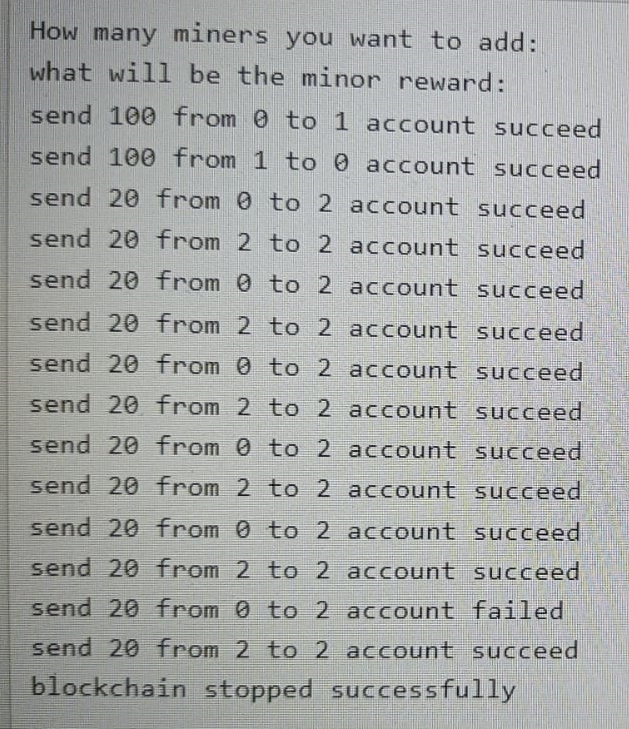

# Blockchain Simulation

This project is a blockchain simulation developed by Abhishek Thakur. It implements a basic blockchain structure and features such as transaction processing and proof-of-work algorithm.

## Features

- Transaction processing: The blockchain supports transaction processing, allowing users to create and verify transactions.
- Proof-of-work algorithm: The blockchain utilizes a proof-of-work algorithm to secure the network and validate new blocks.
- Block validation: Blocks are validated using cryptographic hashing techniques to ensure the integrity of the blockchain.
- Consensus mechanism: The blockchain employs a consensus mechanism to achieve agreement among network participants on the valid state of the blockchain.

## Getting Started

To get started with the project, clone the repository and follow the instructions below:

1. Install the necessary dependencies (if any).
2. Compile the C++ code using a C++ compiler (e.g., g++).
3. Run the compiled executable to start the blockchain simulation.
 
## Screenshots

## Contributing

Contributions are welcome! 

## License

This project is licensed under the [MIT License](LICENSE).

## Contact

For any questions or feedback, feel free to reach out to Abhishek Thakur at abhishek1545jnv.com.
